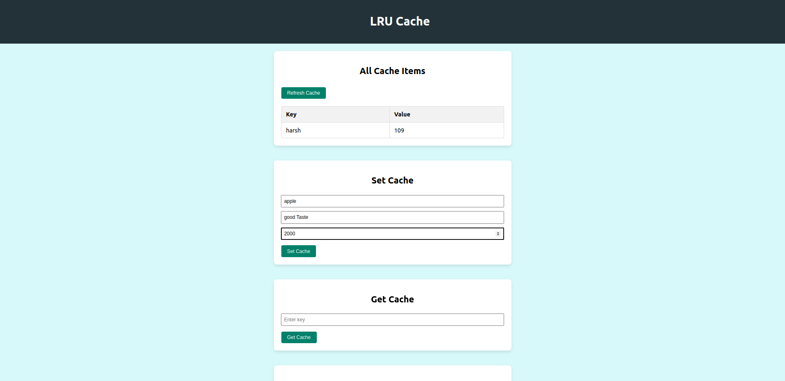
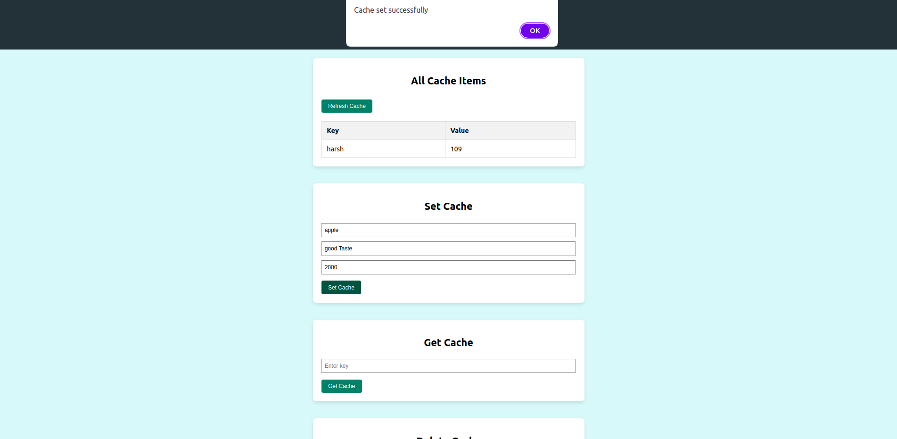
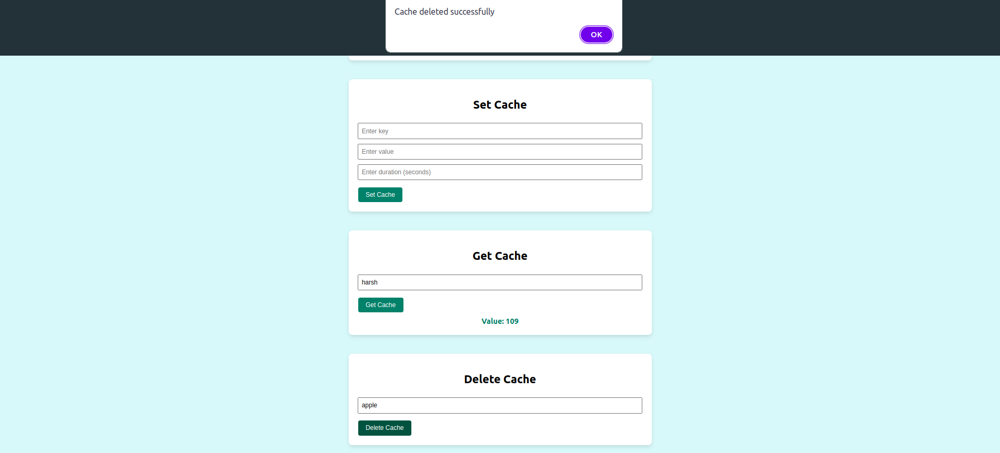

# LRU Cache Frontend

This Project facilates LRU(Least Recently Used) functionality and has following UI -

<div style="text-align: center;">
  
  <br><br>
  
  <br><br>
  
</div>

## How to run

**Clone the Repo**

```sh
 git clone https://github.com/harshsri28/lruCache-Frontend.git
```

**Install the Dependency**

```sh
npm i
```

**Run The Application**

```sh
npm start
```

**Features**

- **Set Cache:** Add items to the cache with a specified expiration duration.
- **Get Cache:** Retrieve items from the cache by key.
- **Delete Cache:** Remove items from the cache by key.
- **View All Cache Items:** Display all items currently in the cache.
- **Real-time Updates:** Automatically updates the UI when cache items expire, using WebSockets.
