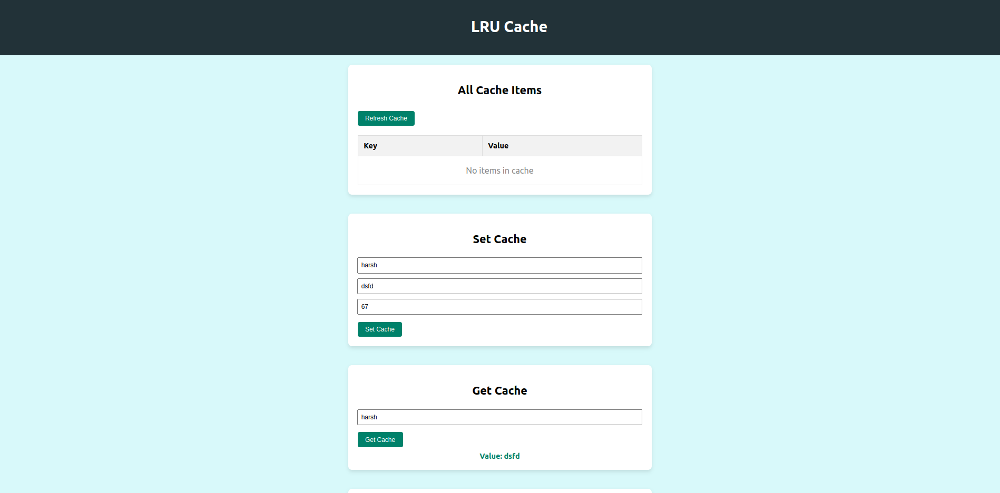
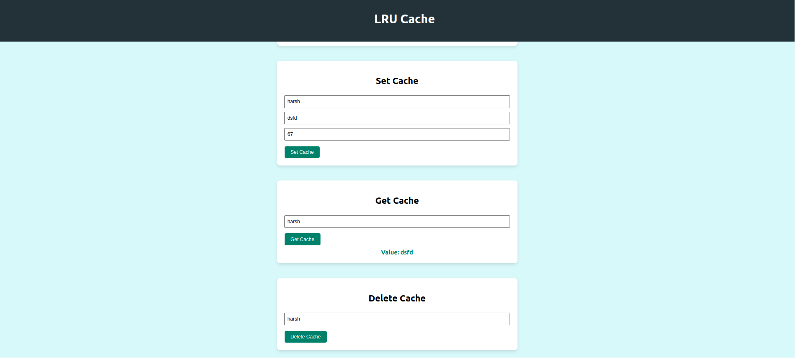

# LRU Cache Frontend

This Project facilates LRU(Least Recently Used) functionality and has following UI -

<div style="text-align: center;">
  
  <br><br>
  
</div>

## How to run

**Clone the Repo**

```sh
 git clone https://github.com/harshsri28/lruCache-Frontend.git
```

**Install the Dependency**

```sh
npm i
```

**Run The Application**

```sh
npm start
```
